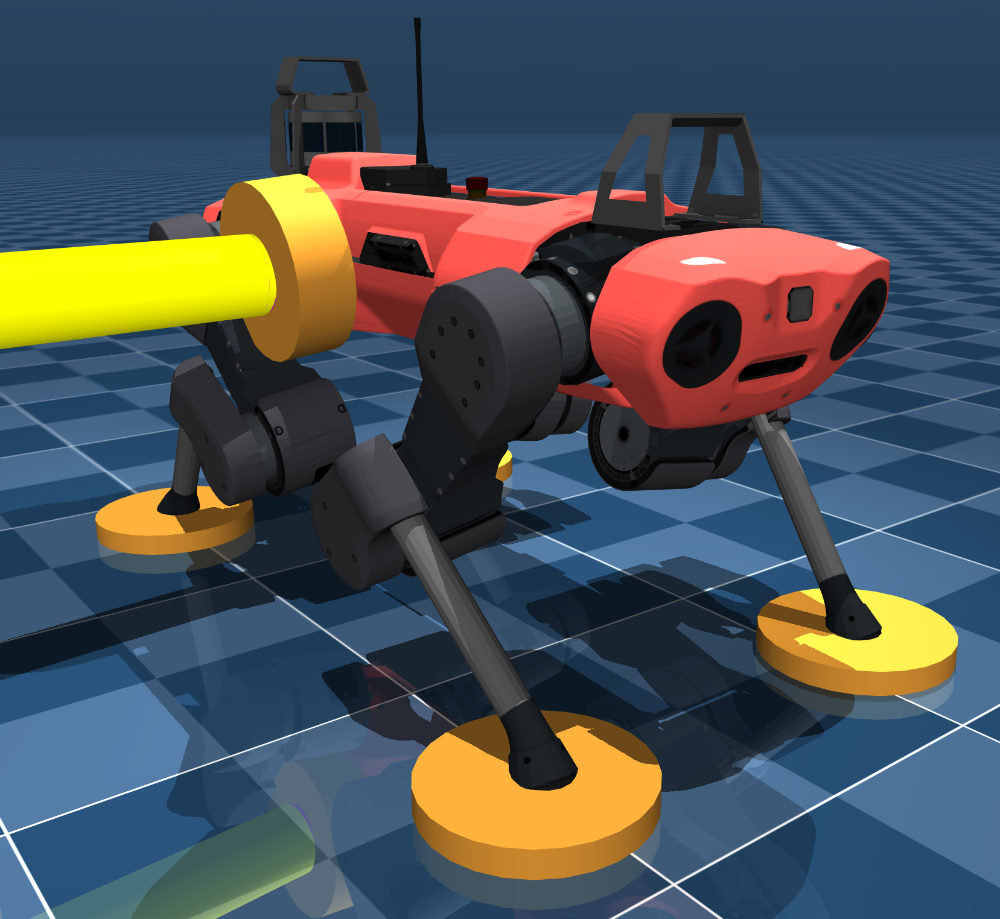

 


# haptiquad_mujoco
## Description
This repo has been used to validate the [`haptiquad_ros2`](https://github.com/mlisi1/haptiquad_ros2/tree/main) and [`haptiquad_contacts`](https://github.com/mlisi1/haptiquad_contacts/tree/main) estimators. It sets up a MuJoCo simulation with the ANYmal C robot, configured to exchange the necessary data with the estimators. `haptiquad_ros2` is able to estimate ground reaction forces and the floating base wrench expressed in the `world` reference frame exploiting the residual theory, while `haptiquad_contacts` uses the estimated base wrench to estimate the contact point on the base surface.
For more information on how the estimations are performed or how to use the packages, refer to the respective repository descriptions.

<div style="text-align: center;">
  
</div>

## Installation
First of all, set up the repo:
```bash
git clone git@github.com:mlisi1/haptiquad_mujoco.git
cd haptiquad_mujoco/
git submodule update --init --recursive
```
Now, the [`CHAMP`](https://github.com/chvmp/champ/tree/ros2) repository, used to make the robot move in the simulation, needs a fix to one of its submodules. While the cloned branch is set to `ros2`, its core submodule is not. To address this, edit the file`haptiquad_mujoco/champ/.gitmodules` and set `branch = ros2` and then execute `git submodule update --init --recursive --remote`.

To build the packages use in the `haptiquad_mujoco` folder:
```bash
bash build.sh
source install/setup.bash
```
Mind that [`haptiquad_contacts`](https://github.com/mlisi1/haptiquad_contacts/tree/main) needs [Open3D](https://github.com/isl-org/Open3D) to be compiled.

## Usage
To launch the packages:
```bash
ros2 launch haptiquad_mujoco_bringup haptiquad_mujoco_anymal.launch.py
```
This launch file will execute the Mujoco simulation and the `haptiquad_ros2` packages needed for the estimation. The estimated forces and wrench are published on the topic `haptiquad_ros2/estimated_forces`. If you want the simulation to run on the nVidia GPU, use the flag `use_nvidia:=true`.

The launch also has other functionalities:
+ `force:=true` executes ForcePlotter, that compares the true force measurements from the simulation with the estimated ones
+ `residuals:=true` executes ResidualPlotter, that allows to see the calculated residuals
+ `estimate_contacts:=true` launches the `haptiquad_contacts` nodes, enabling the contact point estimation. This will also launch rViz to visualize the true and estimated contact points and a node that plots the error between the two.

### Contact testing
To test the contact point estimation, an object has been placed in the scene that can be dragged around and touch the robot. To do this, double-click the object and then Ctrl + Shift + Right Click to drag the object around and poke the robot's base.


---

It is also possible to make the robot move:
```
ros2 run teleop_twist_keyboard teleop_twist_keyboard
```
Mind that the simulated actuators gains are not perfect, so the movements are not exactly what they should be.